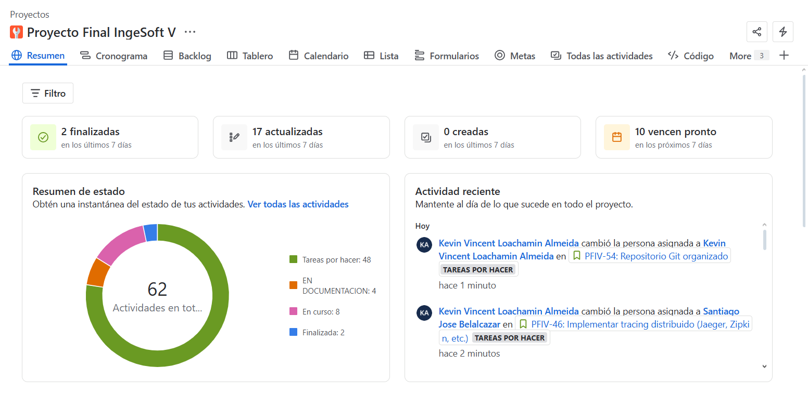
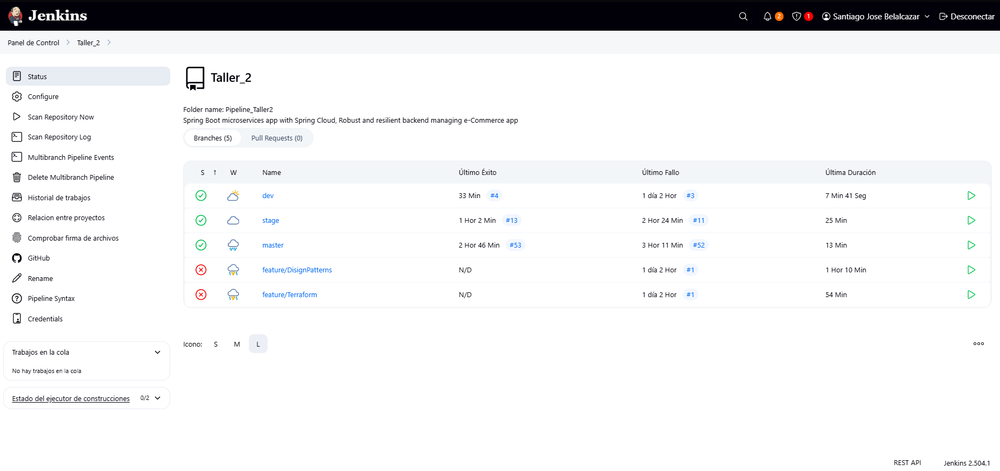
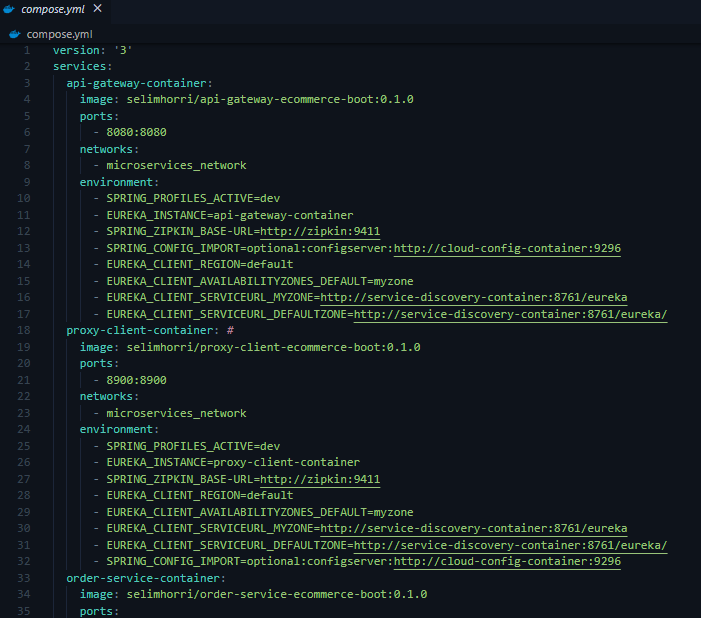

# Documentación del Proyecto eCommerce Microservices

### Santiago Jose Belalcazar - A00381777
### Kevin Vincent Loachamin Almeida - A00382106

## 1. Introducción

### 1.1 Objetivo del Taller

Este taller tiene como propósito guiar el desarrollo de una arquitectura de microservicios robusta y escalable para un sistema de comercio electrónico, aplicando las mejores prácticas de ingeniería de software. El proyecto busca no solo implementar la solución técnica, sino también fomentar la comprensión profunda de los principios de microservicios, DevOps, automatización y calidad de software. Los objetivos principales son:

- **Diseñar una arquitectura desacoplada y escalable**, donde cada microservicio pueda evolucionar y desplegarse de forma independiente, facilitando la innovación y la resiliencia.
- **Automatizar el ciclo de vida del software** mediante pipelines CI/CD con Jenkins, asegurando entregas rápidas, seguras y repetibles.
- **Garantizar portabilidad y consistencia** usando Docker para la containerización de servicios, permitiendo que el entorno de desarrollo, pruebas y producción sean equivalentes.
- **Orquestar y gestionar servicios en producción** con Kubernetes, asegurando alta disponibilidad, autoescalado y despliegues controlados.
- **Implementar un enfoque integral de testing**, cubriendo desde pruebas unitarias hasta pruebas de rendimiento, para asegurar la calidad y confiabilidad del sistema.
- **Asegurar observabilidad y trazabilidad** con herramientas de monitoreo distribuido, facilitando la detección y resolución de problemas en entornos complejos.
- **Centralizar la gestión de configuración** para mantener la coherencia y flexibilidad en todos los entornos.

### 1.2 Metodología Ágil: Scrum

El desarrollo de este proyecto se realiza siguiendo la **metodología ágil Scrum**, permitiendo una gestión iterativa e incremental del trabajo, con entregas frecuentes y retroalimentación continua. El proyecto se planifica en **2 sprints**, cada uno con objetivos claros y entregables definidos, asegurando la culminación exitosa del sistema en el tiempo estimado.

- **Sprint 1:** Enfocado en la arquitectura base, configuración de infraestructura, despliegue inicial de microservicios y pruebas unitarias/integración.
- **Sprint 2:** Orientado a la integración completa, pruebas E2E, optimización, pruebas de rendimiento y despliegue final en producción.

Esta estructura facilita la adaptación a cambios, la colaboración entre los miembros del equipo y la entrega continua de valor.

---

### 1.3 Herramienta de Gestión Ágil: Jira

Para la gestión y seguimiento de la metodología Scrum, se utiliza **Jira** como herramienta principal. Jira permite organizar y visualizar el backlog, las historias de usuario, tareas técnicas y el avance de los sprints, proporcionando transparencia y control sobre el progreso del proyecto.

- **Configuración del proyecto en Jira:**
    

- **Historias de usuario y backlog:**
    
    
    
    
    

- **Sprints inicializados y tablero Scrum:**
  

Estos espacios permiten documentar visualmente la organización y el avance del proyecto, facilitando la comunicación y la toma de decisiones dentro del equipo.

---

### 1.4 Estrategia de Branching

Para garantizar un flujo de trabajo ordenado, colaborativo y seguro, el repositorio implementa una **estrategia de branching GitHub Flow** basada en las mejores prácticas de integración y entrega continua. Esta estrategia permite aislar el desarrollo de nuevas funcionalidades, facilitar pruebas en diferentes entornos y asegurar la estabilidad del código en producción.

#### Ramas principales del repositorio

- **master**
  - Es la rama principal y representa el entorno de **producción**.
  - Solo recibe cambios validados y probados, generalmente mediante pull requests desde `stage`.
  - Cada despliegue a producción se realiza desde esta rama.
- **stage**
  - Rama intermedia destinada al entorno de **staging**.
  - Aquí se integran y prueban los cambios antes de ser promovidos a producción.
  - Recibe merges desde `dev` y es utilizada para pruebas end-to-end, integración y rendimiento.
- **dev**
  - Rama de **desarrollo** activo.
  - Todos los desarrolladores integran aquí sus cambios antes de pasar a `stage`.
  - Es el espacio para validación temprana, pruebas unitarias y de integración.


#### Ramas de soporte

- **feature/\***
  - Para cada nueva funcionalidad o mejora, se crea una rama `feature/nombre-funcionalidad` a partir de `dev`.
  - Permite el desarrollo aislado de nuevas características sin afectar la estabilidad de las ramas principales.
  - Una vez completada y revisada, la rama feature se fusiona de vuelta a `dev` mediante pull request.

#### Flujo de trabajo

1. **Crear rama feature:**
   - Desde `dev`, crear una rama `feature/nueva-funcionalidad`.
2. **Desarrollar y probar localmente:**
   - Realizar commits y pruebas en la rama feature.
3. **Merge a dev:**
   - Al finalizar, abrir un pull request hacia `dev` para revisión y pruebas unitarias/integración.
4. **Promover a stage:**
   - Una vez validados los cambios en `dev`, se realiza merge a `stage` para pruebas E2E y de rendimiento.
5. **Despliegue a producción:**
   - Tras la validación en `stage`, los cambios se fusionan a `master` para el despliegue final.

#### Beneficios de la estrategia

- Permite desarrollo paralelo y seguro de nuevas funcionalidades.
- Facilita la integración y pruebas en diferentes entornos antes de llegar a producción.
- Minimiza riesgos de errores en producción y mejora la trazabilidad de cambios.
- Compatible con pipelines CI/CD automatizados para cada rama.

---

### 1.5 Microservicios Seleccionados y Justificación

La arquitectura está compuesta por **10 microservicios principales** y **3 servicios de infraestructura**, cada uno diseñado para cumplir una responsabilidad específica dentro del ecosistema de comercio electrónico:

#### Microservicios de Negocio

| Microservicio | Puerto | Justificación |
|---------------|--------|---------------|
| **user-service** | 8700 | Gestiona toda la lógica relacionada con usuarios (registro, autenticación, perfiles). Separado para permitir escalabilidad independiente y seguridad especializada. |
| **product-service** | 8500 | Maneja el catálogo de productos, inventario y búsquedas. Crucial para el rendimiento ya que es uno de los servicios más consultados. |
| **order-service** | 8300 | Procesa y gestiona pedidos. Requiere alta disponibilidad y consistencia de datos, por lo que se beneficia de estar aislado. |
| **payment-service** | 8400 | Procesa transacciones financieras. Separado por seguridad, cumplimiento PCI-DSS y para permitir integración con múltiples gateways de pago. |
| **shipping-service** | 8600 | Gestiona envíos y logística. Permite integración independiente con diferentes proveedores de transporte. |
| **favourite-service** | 8800 | Maneja listas de favoritos de usuarios. Microservicio ligero que puede escalar independientemente según el uso. |

#### Servicios de Infraestructura

| Servicio | Puerto | Justificación |
|----------|--------|---------------|
| **service-discovery** (Eureka) | 8761 | Registro y descubrimiento automático de servicios. Fundamental para la comunicación dinámica entre microservicios. |
| **cloud-config** | 9296 | Configuración centralizada externa. Permite cambios de configuración sin redespliegue y mantiene consistencia entre entornos. |
| **api-gateway** | - | Punto de entrada único para clientes. Proporciona routing, load balancing, autenticación y rate limiting. |

#### Servicios de Soporte

| Servicio | Puerto | Justificación |
|----------|--------|---------------|
| **proxy-client** | - | Cliente proxy para comunicación entre servicios. Abstrae la comunicación HTTP y maneja circuit breakers. |
| **zipkin** | 9411 | Trazabilidad distribuida. Esencial para debugging y monitoring de requests que atraviesan múltiples servicios. |

### 1.6 Herramientas y Tecnologías Utilizadas

#### 🔧 Desarrollo y Framework
- **Spring Boot**: Framework principal para el desarrollo de microservicios Java

- **Maven**: Gestión de dependencias y construcción de proyectos
- **Java 11**: Versión LTS para estabilidad y soporte a largo plazo

#### DevOps y CI/CD
- **Jenkins**: Orquestación de pipelines de CI/CD con stages automatizados
  - Construcción y empaquetado con Maven
  - Ejecución de pruebas automatizadas (unitarias, integración, E2E)
  - Construcción y push de imágenes Docker
  - Despliegue automatizado en Kubernetes
- **Git**: Control de versiones con branching strategy (dev, release, master)

####  Containerización y Orquestación
- **Docker**: Containerización de todos los servicios para garantizar portabilidad
- **Docker Hub**: Registro de imágenes para distribución
- **Kubernetes**: Orquestación de contenedores con manifests YAML
  - Deployments, Services, ConfigMaps
  - Health checks y rolling updates
  - Namespace isolation (`ecommerce`)

####  Testing y Calidad
- **JUnit**: Pruebas unitarias para lógica de negocio
- **Spring Boot Test**: Pruebas de integración con contexto de aplicación
- **Locust**: Herramienta de testing de performance y estrés
  - Pruebas de carga con 5 usuarios concurrentes
  - Pruebas de estrés con 10 usuarios concurrentes
  - Generación de reportes HTML con métricas detalladas
- **Testcontainers**: Testing de integración con contenedores reales


Esta arquitectura robusta permite escalabilidad horizontal, fault tolerance, y deployment independiente de cada servicio, cumpliendo con los principios fundamentales de microservicios y las mejores prácticas de la industria.

## 2. Arquitectura General

### 2.1 Diagrama de Arquitectura de Microservicios

El siguiente diagrama ilustra la arquitectura lógica del sistema, mostrando la interacción entre microservicios, servicios de infraestructura y componentes de soporte. Esta visión global facilita la comprensión de los flujos de datos, la resiliencia y la escalabilidad del sistema.


### 2.2 Interacciones entre los Servicios

- **API Gateway:** Punto de entrada único, gestiona autenticación, balanceo de carga y enrutamiento inteligente.
- **Service Discovery (Eureka):** Permite el registro y descubrimiento dinámico de servicios, facilitando la escalabilidad y tolerancia a fallos.
- **Cloud Config:** Centraliza la configuración, permitiendo cambios sin redespliegue y manteniendo la coherencia entre entornos.
- **Proxy Client:** Abstrae la comunicación HTTP y gestiona circuit breakers, mejorando la resiliencia.
- **Zipkin:** Proporciona trazabilidad distribuida, esencial para el monitoreo y la depuración de flujos complejos.
- **Microservicios de negocio:** Interactúan mediante llamadas HTTP internas, gestionadas por el API Gateway y el Service Discovery, asegurando independencia y escalabilidad.


### 2.3 Patrones de Diseño en la Nube Implementados

La arquitectura implementa varios **Cloud Design Patterns** que garantizan escalabilidad, resiliencia y mantenibilidad:

#### Service Discovery Pattern
Permite que los microservicios se registren y descubran dinámicamente.
- **Implementación:** Eureka.
- **Ejemplo:**
order-service
  [`@EnableEurekaClient`](order-service/src/main/java/com/selimhorri/app/OrderServiceApplication.java#L7)
  
  ```java
  @SpringBootApplication
  @EnableEurekaClient
  public class OrderServiceApplication {
    
    public static void main(String[] args) {
      SpringApplication.run(OrderServiceApplication.class, args);
    }
  }
  ```
  user-service
  [`@EnableEurekaClient`](user-service/src/main/java/com/selimhorri/app/UserServiceApplication.java#L7)
  
  ```java
  @SpringBootApplication
  @EnableEurekaClient
  public class UserServiceApplication {

    public static void main(String[] args) {
      SpringApplication.run(UserServiceApplication.class, args);
    }
  }
  ```
  product-service
  [`@EnableEurekaClient`](product-service/src/main/java/com/selimhorri/app/ProductServiceApplication.java#L7)

  ```java
  @SpringBootApplication
  @EnableEurekaClient
  public class ProductServiceApplication {

    public static void main(String[] args) {
      SpringApplication.run(ProductServiceApplication.class, args);
    }
  }
  ```

#### API Gateway Pattern
Punto de entrada único para clientes, maneja enrutamiento y autenticación.
- **Implementación:** Microservicio [`api-gateway`](api-gateway/).
- **Referencia:** [k8s/api-gateway/deployment.yaml](k8s/api-gateway/deployment.yaml)

#### Centralized Configuration Pattern
Gestión centralizada de configuración para todos los servicios.
- **Implementación:** Spring Cloud Config.
- **Ejemplo:**
  [`@EnableConfigServer`](cloud-config/src/main/java/com/selimhorri/app/CloudConfigApplication.java#L7)
  ```java
  @SpringBootApplication
  @EnableEurekaClient
  @EnableConfigServer
  public class CloudConfigApplication {
    
    public static void main(String[] args) {
      SpringApplication.run(CloudConfigApplication.class, args);
    }
  }
  ```

#### Client-Side Load Balancing Pattern
Balanceo de carga entre instancias de servicios.
- **Implementación:** `@LoadBalanced` en RestTemplate.
- **Ejemplo:**
  [`@LoadBalanced`](proxy-client/src/main/java/com/selimhorri/app/config/template/TemplateConfig.java#L8)
  ```java
  @Configuration
  public class TemplateConfig {
    
    @LoadBalanced
    @Bean
    public RestTemplate restTemplateBean() {
      return new RestTemplate();
    }
  }
  ```

#### Circuit Breaker / Resilience Pattern
Previene fallos en cascada y mejora la resiliencia.
- **Implementación:** Feign Client preparado para circuit breakers.
- **Ejemplo:**
  ProductClientService
  [`@FeignClient`](proxy-client/src/main/java/com/selimhorri/app/business/product/service/ProductClientService.java#L13)
    ```java
  @FeignClient(name = "PRODUCT-SERVICE", contextId = "productClientService", path = "/product-service/api/products")
  public interface ProductClientService {
    
    @GetMapping
    ResponseEntity<ProductProductServiceCollectionDtoResponse> findAll();
    
    @GetMapping("/{productId}")
    ResponseEntity<ProductDto> findById(
        @PathVariable("productId") 
        @NotBlank(message = "Input must not be blank!") 
        @Valid final String productId);
    
    @PostMapping
    ResponseEntity<ProductDto> save(
        @RequestBody 
        @NotNull(message = "Input must not be NULL!") 
        @Valid final ProductDto productDto);
    
    [...]
    
  }
  ```

  OrderClientService
  [`@FeignClient`](proxy-client/src/main/java/com/selimhorri/app/business/order/service/OrderClientService.java#L13)

  ```java
  @FeignClient(name = "ORDER-SERVICE", contextId = "orderClientService", path = "/order-service/api/orders")
  public interface OrderClientService {
    
    @GetMapping
    public ResponseEntity<OrderOrderServiceDtoCollectionResponse> findAll();
    
    @GetMapping("/{orderId}")
    public ResponseEntity<OrderDto> findById(
        @PathVariable("orderId") 
        @NotBlank(message = "Input must not be blank!") 
        @Valid final String orderId);
    
    @PostMapping
    public ResponseEntity<OrderDto> save(
        @RequestBody 
        @NotNull(message = "Input must not be NULL!") 
        @Valid final OrderDto orderDto);
    
    [...]
    
  }
  ```

#### Proxy Pattern
Desacopla la lógica de negocio de la comunicación entre servicios.
- **Implementación:** Microservicio [`proxy-client`](proxy-client/).
- **Ejemplo:**
  [`ProductClientService.java`](proxy-client/src/main/java/com/selimhorri/app/business/product/service/ProductClientService.java)
  [`OrderClientService.java`](proxy-client/src/main/java/com/selimhorri/app/business/order/service/OrderClientService.java)

#### Sidecar Pattern (Observability)
Agrega monitoreo y trazabilidad sin modificar el código principal.
- **Implementación:** Zipkin.
- **Referencia:** [`zipkin/`](zipkin/)

#### Containerization & Orchestration
Portabilidad y gestión automatizada de microservicios.
- **Implementación:** Docker y Kubernetes.
- **Referencia:**
  [`Dockerfile` de cada microservicio](product-service/Dockerfile)
  [`k8s/`](k8s/)

#### Health Check Pattern
Monitoreo y reinicio automático de servicios no saludables.
- **Implementación:** Health checks en manifiestos de Kubernetes.
- **Referencia:**
  [`k8s/api-gateway/deployment.yaml`](k8s/api-gateway/deployment.yaml)

  ```java
    [...]

       livenessProbe:
         httpGet:
           path: /actuator/health
           port: 8080
         initialDelaySeconds: 90
         periodSeconds: 10
         failureThreshold: 3
       readinessProbe:
         httpGet:
           path: /actuator/health
           port: 8080
         initialDelaySeconds: 60
         periodSeconds: 5
         failureThreshold: 3
       volumeMounts:
       - name: common-config-volume
         mountPath: /app/config
     volumes:
     - name: common-config-volume
       configMap:
         name: common-config
  ```

  [`k8s/order-service/deployment.yaml`](k8s/order-service/deployment.yaml)

    ```java
    [...]

        livenessProbe:
          httpGet:
            path: /order-service/actuator/health
            port: 8300
          initialDelaySeconds: 90
          periodSeconds: 10
          failureThreshold: 3
        readinessProbe:
          httpGet:
            path: /order-service/actuator/health
            port: 8300
          initialDelaySeconds: 60
          periodSeconds: 5
          failureThreshold: 3
        volumeMounts:
        - name: common-config-volume
          mountPath: /app/config
      volumes:
      - name: common-config-volume
        configMap:
          name: common-config 
  ```

#### Externalized Configuration Pattern
Uso de constantes y variables externas para endpoints y configuración.
- **Ejemplo:**
  [`AppConstant.DiscoveredDomainsApi`](shipping-service/src/main/java/com/selimhorri/app/constant/AppConstant.java#L16-L36)

  ```java
  @NoArgsConstructor(access = AccessLevel.PRIVATE)
	public abstract class DiscoveredDomainsApi {
		
		public static final String USER_SERVICE_HOST = "http://USER-SERVICE/user-service";
		public static final String USER_SERVICE_API_URL = "http://USER-SERVICE/user-service/api/users";
		
		public static final String PRODUCT_SERVICE_HOST = "http://PRODUCT-SERVICE/product-service";
		public static final String PRODUCT_SERVICE_API_URL = "http://PRODUCT-SERVICE/product-service/api/products";
		
		public static final String ORDER_SERVICE_HOST = "http://ORDER-SERVICE/order-service";
		public static final String ORDER_SERVICE_API_URL = "http://ORDER-SERVICE/order-service/api/orders";
		
		public static final String FAVOURITE_SERVICE_HOST = "http://FAVOURITE-SERVICE/favourite-service";
		public static final String FAVOURITE_SERVICE_API_URL = "http://FAVOURITE-SERVICE/favourite-service/api/favourites";
		
		public static final String PAYMENT_SERVICE_HOST = "http://PAYMENT-SERVICE/payment-service";
		public static final String PAYMENT_SERVICE_API_URL = "http://PAYMENT-SERVICE/payment-service/api/payments";
		
		public static final String SHIPPING_SERVICE_HOST = "http://SHIPPING-SERVICE/shipping-service";
		public static final String SHIPPING_SERVICE_API_URL = "http://SHIPPING-SERVICE/shipping-service/api/shippings";
		
	}
  ```

  [`AppConstant.DiscoveredDomainsApi`](product-service/src/main/java/com/selimhorri/app/constant/AppConstant.java#L16-L38)

  ```java
  	@NoArgsConstructor(access = AccessLevel.PRIVATE)
	public abstract class DiscoveredDomainsApi {
		
		public static final String USER_SERVICE_HOST = "http://USER-SERVICE/user-service";
		public static final String USER_SERVICE_API_URL = "http://USER-SERVICE/user-service/api/users";
		
		public static final String PRODUCT_SERVICE_HOST = "http://PRODUCT-SERVICE/product-service";
		public static final String PRODUCT_SERVICE_API_URL = "http://PRODUCT-SERVICE/product-service/api/products";
		
		public static final String ORDER_SERVICE_HOST = "http://ORDER-SERVICE/order-service";
		public static final String ORDER_SERVICE_API_URL = "http://ORDER-SERVICE/order-service/api/orders";
		
		public static final String FAVOURITE_SERVICE_HOST = "http://FAVOURITE-SERVICE/favourite-service";
		public static final String FAVOURITE_SERVICE_API_URL = "http://FAVOURITE-SERVICE/favourite-service/api/favourites";
		
		public static final String PAYMENT_SERVICE_HOST = "http://PAYMENT-SERVICE/payment-service";
		public static final String PAYMENT_SERVICE_API_URL = "http://PAYMENT-SERVICE/payment-service/api/payments";
		
		public static final String SHIPPING_SERVICE_HOST = "http://SHIPPING-SERVICE/shipping-service";
		public static final String SHIPPING_SERVICE_API_URL = "http://SHIPPING-SERVICE/shipping-service/api/shippings";
		
	}
  ```

  [`AppConstant.DiscoveredDomainsApi`](order-service/src/main/java/com/selimhorri/app/constant/AppConstant.java#L16-L38)

  ```java
  @NoArgsConstructor(access = AccessLevel.PRIVATE)
	public abstract class DiscoveredDomainsApi {
		
		public static final String USER_SERVICE_HOST = "http://USER-SERVICE/user-service";
		public static final String USER_SERVICE_API_URL = "http://USER-SERVICE/user-service/api/users";
		
		public static final String PRODUCT_SERVICE_HOST = "http://PRODUCT-SERVICE/product-service";
		public static final String PRODUCT_SERVICE_API_URL = "http://PRODUCT-SERVICE/product-service/api/products";
		
		public static final String ORDER_SERVICE_HOST = "http://ORDER-SERVICE/order-service";
		public static final String ORDER_SERVICE_API_URL = "http://ORDER-SERVICE/order-service/api/orders";
		
		public static final String FAVOURITE_SERVICE_HOST = "http://FAVOURITE-SERVICE/favourite-service";
		public static final String FAVOURITE_SERVICE_API_URL = "http://FAVOURITE-SERVICE/favourite-service/api/favourites";
		
		public static final String PAYMENT_SERVICE_HOST = "http://PAYMENT-SERVICE/payment-service";
		public static final String PAYMENT_SERVICE_API_URL = "http://PAYMENT-SERVICE/payment-service/api/payments";
		
		public static final String SHIPPING_SERVICE_HOST = "http://SHIPPING-SERVICE/shipping-service";
		public static final String SHIPPING_SERVICE_API_URL = "http://SHIPPING-SERVICE/shipping-service/api/shippings";
		
	}
  ```


---

Estos patrones están presentes en la arquitectura y el código fuente del proyecto, asegurando una solución robusta, escalable y alineada con las mejores prácticas de la industria.

### 2.3.1 Patrones de Diseño Mejorados

### Mejora Implementada: Circuit Breaker / Resilience Pattern

Para fortalecer la resiliencia y la tolerancia a fallos en la arquitectura de microservicios, se mejoró la implementación del patrón **Circuit Breaker** en todos los Feign Clients del microservicio `proxy-client`. Esta mejora garantiza que, ante la caída o lentitud de un microservicio dependiente, el sistema responde de manera controlada y evita fallos en cascada.

#### ¿En qué consistió la mejora?

- **Creación de clases fallback** para cada Feign Client, devolviendo respuestas controladas o vacías cuando el servicio remoto no está disponible.
- **Asociación explícita del fallback** en la anotación `@FeignClient` de cada interfaz.
- **Cobertura total**: Se implementó para los servicios de producto, orden, usuario, credenciales, dirección, favoritos, pagos, categorías y order items.
- **Personalización de respuestas**: Cada fallback retorna datos vacíos, nulos o mensajes de error controlados según la lógica de negocio, permitiendo que el frontend o los servicios consumidores manejen adecuadamente la indisponibilidad temporal.

#### Ejemplo de implementación

**1. Clase Fallback para ProductClientService:**
```java
@Component
public class ProductClientServiceFallback implements ProductClientService {

    @Override
    public ResponseEntity<ProductProductServiceCollectionDtoResponse> findAll() {
        return ResponseEntity.ok(new ProductProductServiceCollectionDtoResponse());
    }

    @Override
    public ResponseEntity<ProductDto> findById(String productId) {
        return ResponseEntity.ok(new ProductDto());
    }

    @Override
    public ResponseEntity<ProductDto> save(ProductDto productDto) {
        return ResponseEntity.ok(new ProductDto());
    }

    @Override
    public ResponseEntity<ProductDto> update(ProductDto productDto) {
        return ResponseEntity.ok(new ProductDto());
    }

    @Override
    public ResponseEntity<ProductDto> update(String productId, ProductDto productDto) {
        return ResponseEntity.ok(new ProductDto());
    }

    @Override
    public ResponseEntity<Boolean> deleteById(String productId) {
        return ResponseEntity.ok(Boolean.FALSE);
    }
    
}
```

**2. Asociación del fallback en la interfaz Feign Client:**
```java
@FeignClient(
    name = "PRODUCT-SERVICE",
    contextId = "productClientService",
    path = "/product-service/api/products",
    fallback = ProductClientServiceFallback.class
)
public interface ProductClientService {
    // Métodos...
}
```

#### Beneficios de la mejora

- **Mayor resiliencia:** El sistema sigue funcionando y responde de forma predecible ante fallos de servicios remotos.
- **Mejor experiencia de usuario:** Se evitan errores inesperados y se pueden mostrar mensajes claros cuando un servicio no está disponible.
- **Facilidad de mantenimiento:** El manejo de fallos está centralizado y es fácilmente extensible a nuevos servicios.
- **Preparación para escenarios reales:** Permite simular y manejar caídas de servicios en pruebas de carga y estrés, validando la robustez de la arquitectura.

#### Servicios cubiertos

- ProductClientService
- OrderClientService
- OrderItemClientService
- PaymentClientService
- FavouriteClientService
- UserClientService
- CredentialClientService
- AddressClientService
- CategoryClientService

---

Esta mejora refuerza el cumplimiento de los principios de microservicios y las mejores prácticas de arquitectura en la nube, asegurando un sistema robusto, escalable y preparado para escenarios de alta disponibilidad.

### 2.3.2 Patrones de Diseño Extra Implementados

#### Retry Pattern

El **Retry Pattern** es un patrón de resiliencia que permite reintentar automáticamente operaciones fallidas, mitigando errores transitorios como fallos de red o caídas temporales de servicios dependientes. Su uso es fundamental en arquitecturas distribuidas para mejorar la robustez y la experiencia del usuario, evitando fallos inmediatos ante errores recuperables.

##### ¿Cómo se implementó?

- **Tecnología:** Se utilizó [Resilience4j Retry](https://resilience4j.readme.io/docs/retry) integrado con Spring Cloud.
- **Cobertura:** El patrón se aplicó a todos los Feign Clients del microservicio `proxy-client`, permitiendo reintentos automáticos en la comunicación con servicios remotos.
- **Configuración centralizada:** Los parámetros de retry (número de intentos, tiempo de espera entre reintentos, excepciones a capturar) se gestionan desde el archivo `application.yml`, facilitando su ajuste sin modificar el código fuente.

##### Ejemplo de implementación

**1. Configuración en `application.yml`:**
```yaml
resilience4j:
  circuitbreaker:
    instances:
      # ...servicios...
  retry:
    instances:
      productClientService:
        max-attempts: 3
        wait-duration: 500ms
        retry-exceptions:
          - org.springframework.web.client.HttpServerErrorException
          - java.io.IOException
      categoryClientService:
        max-attempts: 3
        wait-duration: 500ms
        retry-exceptions:
          - org.springframework.web.client.HttpServerErrorException
          - java.io.IOException
      # ...otros servicios...
```

**2. Anotación en el Feign Client:**
```java
@FeignClient(
    name = "PRODUCT-SERVICE",
    contextId = "productClientService",
    path = "/product-service/api/products",
    fallback = ProductClientServiceFallback.class
)
@Retry(name = "productClientService")
public interface ProductClientService {
    // Métodos...
}
```

##### Beneficios de la implementación

- **Mayor tolerancia a fallos transitorios:** El sistema reintenta automáticamente antes de fallar, mejorando la disponibilidad.
- **Configuración flexible:** Permite ajustar la política de reintentos por servicio según la criticidad o el comportamiento esperado.
- **No intrusivo:** No requiere modificar la lógica de negocio existente.
- **Mejor experiencia de usuario:** Reduce la probabilidad de errores visibles por problemas temporales de red o servicios.

##### Servicios cubiertos

- ProductClientService
- OrderClientService
- OrderItemClientService
- PaymentClientService
- FavouriteClientService
- UserClientService
- CredentialClientService
- AddressClientService
- CategoryClientService
- CartClientService
- VerificationTokenClientService

---

Esta implementación refuerza la resiliencia de la arquitectura, alineándose con las mejores prácticas de sistemas distribuidos en la nube.

#### Rate Limiter Pattern

El **Rate Limiter Pattern** es un patrón de resiliencia que protege los microservicios de sobrecargas y abusos limitando la cantidad de solicitudes permitidas en un periodo de tiempo determinado. Su implementación es fundamental para evitar la degradación del servicio ante picos de tráfico o ataques de denegación de servicio (DoS), garantizando la disponibilidad y estabilidad del sistema.

##### ¿Cómo se implementó?

- **Tecnología:** Se utilizó [Resilience4j RateLimiter](https://resilience4j.readme.io/docs/ratelimiter) integrado con Spring Boot.
- **Cobertura:** El patrón se aplicó en los endpoints REST de los recursos de productos y categorías en el microservicio `product-service`.
- **Configuración centralizada:** Los parámetros del rate limiter (límite de solicitudes, periodo de refresco, timeout) se gestionan desde el archivo `application.yml`, permitiendo su ajuste sin modificar el código fuente.

##### Ejemplo de implementación

**1. Configuración en `application.yml`:**
```yaml
resilience4j:
  ratelimiter:
    instances:
      productApi:
        limit-for-period: 5
        limit-refresh-period: 1s
        timeout-duration: 0
```
Esto permite hasta 5 solicitudes por segundo a los endpoints protegidos bajo el nombre `productApi`.

**2. Anotación en los recursos REST:**
```java
// ProductResource.java
@GetMapping
@RateLimiter(name = "productApi")
public ResponseEntity<DtoCollectionResponse<ProductDto>> findAll() {
    // ...
}

// CategoryResource.java
@GetMapping
@RateLimiter(name = "productApi")
public ResponseEntity<DtoCollectionResponse<CategoryDto>> findAll() {
    // ...
}
```
La anotación `@RateLimiter(name = "productApi")` protege el endpoint, aplicando la política definida en la configuración.

##### Beneficios de la implementación

- **Protección ante sobrecarga:** Evita que un exceso de solicitudes degrade el rendimiento o cause caídas del servicio.
- **Mejor experiencia de usuario:** Garantiza tiempos de respuesta estables y predecibles bajo alta demanda.
- **Configuración flexible:** Permite ajustar los límites de solicitudes según la criticidad del endpoint o la capacidad del servicio.
- **Fácil integración:** No requiere cambios en la lógica de negocio existente y puede aplicarse selectivamente a métodos o clases.

##### Servicios y endpoints cubiertos

- `product-service`:
  - GET `/api/products` (listado de productos)
  - GET `/api/categories` (listado de categorías)

---

Esta implementación fortalece la robustez y disponibilidad del sistema, alineándose con las mejores prácticas de arquitecturas distribuidas y microservicios en la


### 2.4 Ambientes Definidos

El ciclo de vida del software se gestiona a través de tres ambientes principales:

- **dev:** Espacio seguro para experimentación y desarrollo individual.
- **stage:** Entorno de integración y pruebas end-to-end, simula condiciones de producción.
- **master (producción):** Entorno estable y seguro, donde se ejecuta la versión aprobada del sistema.

## 3. Configuración del Entorno

### 3.1 Jenkins (Ejecución Local en Windows con UI)

Jenkins es el motor de automatización que orquesta la construcción, pruebas y despliegue del sistema. Su instalación y configuración en Windows es sencilla y permite gestionar pipelines visualmente desde la interfaz web.

- **Instalación:** Descarga desde [jenkins.io/download](https://www.jenkins.io/download/), instalación asistida y acceso vía navegador.
- **Desbloqueo inicial:** Uso de la clave generada automáticamente para el primer acceso.
- **Plugins recomendados:** Docker Pipeline, Git, Blue Ocean (UI avanzada).
- **Gestión de pipelines:** Creación, monitoreo y parametrización de jobs desde la UI.
- **Pipeline declarativa:** El `Jenkinsfile` define el flujo CI/CD, asegurando reproducibilidad y control de versiones.
- **Despliegue automatizado:** Desde la compilación hasta el despliegue en Kubernetes, todo el ciclo está automatizado y versionado.

**Buenas prácticas:**
- Configurar credenciales y variables sensibles desde la UI de Jenkins.
- Asegurar permisos adecuados para la ejecución de Docker y comandos de despliegue.

### 3.2 Docker y los Dockerfiles de los Microservicios

Docker permite encapsular cada microservicio en una imagen ligera y portable, asegurando que el entorno de ejecución sea idéntico en desarrollo, pruebas y producción.

- **Dockerfile por microservicio:** Define la base, dependencias, variables de entorno y comando de arranque.
- **Imágenes optimizadas:** Uso de imágenes base ligeras y build eficientes.
- **Orquestación local:** Docker Compose permite levantar el sistema completo para pruebas integradas.
- **Automatización en pipeline:** Jenkins construye y publica las imágenes en cada ciclo, garantizando trazabilidad y control de versiones.

### 3.3 Kubernetes

Kubernetes es la plataforma de orquestación que gestiona el ciclo de vida de los contenedores en producción y pruebas.

- **Manifiestos YAML:** Definen deployments, servicios, ConfigMaps y otros recursos.
- **Namespace dedicado:** Aislamiento lógico para el sistema eCommerce.
- **Comandos clave:**
  - `kubectl apply -f k8s/` para desplegar todos los recursos.
  - `kubectl get pods -n ecommerce` y `kubectl get svc -n ecommerce` para monitoreo.
  - `kubectl logs <nombre-del-pod> -n ecommerce` para depuración.
- **Despliegue automatizado:** El pipeline aplica los manifiestos tras la construcción y publicación de imágenes.

### 3.4 Repositorio y Estructura de Carpetas

El repositorio está cuidadosamente organizado para reflejar la separación de responsabilidades y facilitar la navegación y el mantenimiento:

```
ecommerce-microservice-backend-app/
│
├── api-gateway/           # Microservicio API Gateway (con su Dockerfile)
├── cloud-config/          # Servicio de configuración centralizada (con su Dockerfile)
├── favourite-service/     # Microservicio de favoritos (con su Dockerfile)
├── order-service/         # Microservicio de pedidos (con su Dockerfile)
├── payment-service/       # Microservicio de pagos (con su Dockerfile)
├── product-service/       # Microservicio de productos (con su Dockerfile)
├── proxy-client/          # Cliente proxy para comunicación entre servicios (con su Dockerfile)
├── service-discovery/     # Servicio Eureka para descubrimiento (con su Dockerfile)
├── shipping-service/      # Microservicio de envíos (con su Dockerfile)
├── user-service/          # Microservicio de usuarios (con su Dockerfile)
├── zipkin/                # Servicio de trazabilidad distribuida (con su Dockerfile)
│
├── k8s/                   # Manifiestos de Kubernetes
├── locust/                # Pruebas de carga y rendimiento con Locust
├── e2e-tests/             # Pruebas de E2E
├── Jenkinsfile            # Pipeline de CI/CD
├── compose.yml            # Orquestación local con Docker Compose
├── DOCUMENTATION.md       # Documentación del proyecto
├── README.md              # Instrucciones rápidas
└── ...otros archivos
```

Esta estructura promueve la modularidad, la escalabilidad y la facilidad de mantenimiento, permitiendo que cada equipo o desarrollador trabaje de forma independiente en su microservicio, sin interferir con el resto del sistema.

---

## 4. Pipelines de Integración y Entrega Continua

La automatización del ciclo de vida del software es clave para la agilidad y la calidad. En este proyecto, una pipeline declarativa en Jenkins gestiona de forma inteligente los flujos de integración y despliegue para las ramas principales (`dev`, `stage`, `master`). Esto asegura que cada entorno reciba el nivel de validación y control adecuado, minimizando riesgos y acelerando la entrega de valor. Mientras que otro pipeline declarado en Jenkins se encarga de gestionar toda la configuracion y montaje de la infraestructura del proyecto


## Pipeline Principal
gestiona de forma inteligente los flujos de integración y despliegue para las ramas principales (`dev`, `stage`, `master`), incluyendo herramientas de monitoreo, reportes y demas montajes



### 4.1 Pipeline para entorno de desarrollo (`dev`)

El entorno de desarrollo está orientado a la experimentación y validación rápida de cambios. Cada push o pull request a la rama `dev` dispara la pipeline, que ejecuta:

1. Compilación y análisis estático del código para detectar errores tempranos.
2. Pruebas unitarias y de integración para validar la lógica y la interacción interna.
3. Construcción de imágenes Docker etiquetadas como `dev`.
4. Publicación de imágenes en el registro.
5. Despliegue automático en el entorno de desarrollo de Kubernetes.

Esto permite a los desarrolladores recibir feedback inmediato y trabajar en un entorno lo más parecido posible a producción.


### 4.2 Pipeline para entorno de staging (`stage`)

El entorno de staging simula condiciones de producción y es el espacio para validaciones exhaustivas antes del despliegue final. Cada push a la rama `stage` ejecuta:

1. Compilación y pruebas (unitarias, integración y, opcionalmente, end-to-end).
2. Construcción y push de imágenes Docker etiquetadas como `stage`.
3. Despliegue en el entorno de staging de Kubernetes.
4. Ejecución de pruebas automatizadas post-despliegue (carga, estres, E2E, validación de endpoints).

Esto asegura que solo versiones estables y validadas lleguen a producción.

### 4.3 Pipeline de despliegue (`master` / Producción)

El entorno de producción es el más crítico y requiere validaciones adicionales. Cada push o merge a la rama `master` ejecuta:

1. Compilación y pruebas exhaustivas.
2. Construcción y push de imágenes Docker etiquetadas como `prod`.
3. Despliegue en el entorno de producción de Kubernetes.
4. Generación y publicación automática de release notes.
5. Notificación de despliegue exitoso.

Esto garantiza trazabilidad, control y calidad en cada entrega al usuario final.

## Pipeline de infraestructura


### 4.3 Descripción de la Infraestructura del Proyecto

La infraestructura del proyecto está definida y gestionada en la carpeta `Infra`, la cual centraliza todos los recursos y configuraciones necesarias para el despliegue automatizado y la operación estable del ecosistema de microservicios. Esta carpeta contiene tanto la pipeline de infraestructura como los manifiestos terraform y scripts para levantar los servicios fundamentales que soportan la arquitectura.

#### Beneficios de la Infraestructura Centralizada

- **Automatización completa:** Todo el ciclo de provisión y despliegue de infraestructura es reproducible y versionado.
- **Escalabilidad:** Permite modificar o escalar servicios de soporte sin afectar los microservicios de negocio.
- **Mantenibilidad:** Facilita la actualización y el monitoreo de los servicios core desde un único punto.
- **Seguridad y consistencia:** La gestión centralizada de configuración y secretos asegura coherencia y control de acceso.


### 4.4 Resumen del manejo de ramas y pipeline

La pipeline única, combinada con la directiva `when { branch 'nombre' }`, permite adaptar el flujo a cada entorno, asegurando que cada rama reciba el tratamiento adecuado y que los despliegues sean seguros, trazables y eficientes.

---
#### **Resultados de SonarQube**

El análisis automático de calidad de código se realiza con SonarQube en cada pipeline. Todos los microservicios del proyecto son evaluados bajo los criterios de seguridad, mantenibilidad y fiabilidad definidos en el Quality Gate.

- **Resultado global:**  
  Todos los microservicios han superado el Quality Gate, mostrando el indicador "Passed".
- **Indicadores clave:**  
  - **Seguridad:** Sin vulnerabilidades detectadas.
  - **Fiabilidad:** Sin bugs críticos ni bloqueantes.
  - **Mantenibilidad:** Código limpio, sin deuda técnica significativa.

Esto garantiza que el código fuente cumple con los estándares de calidad requeridos antes de ser promovido a los entornos superiores.


**Implementación de SonarQube en la pipeline (Jenkinsfile):**
```groovy
stage('Run SonarQube Analysis') {
    when { branch 'master' }
    tools {
        jdk 'JDK 17'
    }
    environment {
        JAVA_HOME = tool 'JDK 17'
        PATH = "${JAVA_HOME}/bin:${env.PATH}"
        scannerHome = tool 'lil-sonar-tool'
    }
    steps {
        script {
            def javaServices = [
                'api-gateway',
                'cloud-config',
                'favourite-service',
                'order-service',
                'payment-service',
                'product-service',
                'proxy-client',
                'service-discovery',
                'shipping-service',
                'user-service',
                'e2e-tests'
            ]

            withSonarQubeEnv(credentialsId: 'sonarqube_password', installationName: 'lil sonar installation') {
                javaServices.each { service ->
                    dir(service) {
                        bat "${scannerHome}/bin/sonar-scanner " +
                        "-Dsonar.projectKey=${service} " +
                        "-Dsonar.projectName=${service} " +
                        '-Dsonar.sources=src ' +
                        '-Dsonar.java.binaries=target/classes'
                    }
                }

                dir('locust') {
                    bat "${scannerHome}/bin/sonar-scanner " +
                    '-Dsonar.projectKey=locust ' +
                    '-Dsonar.projectName=locust ' +
                    '-Dsonar.sources=test'
                }
            }
        }
    }
}

```

---

## 5. Diseño y Ejecución de Pruebas

La calidad del software es un pilar fundamental en sistemas distribuidos. Este proyecto implementa una estrategia de testing integral, cubriendo desde la lógica interna de cada microservicio hasta la experiencia real del usuario y el rendimiento bajo carga. Cada tipo de prueba aporta una capa de confianza y permite detectar errores en diferentes etapas del ciclo de vida.

### 5.1 Pruebas Unitarias

Las pruebas unitarias validan la lógica de negocio de cada componente de forma aislada, usando JUnit y Mockito. Permiten detectar errores en etapas tempranas y facilitan el refactorizado seguro. Cada microservicio cuenta con pruebas enfocadas en sus métodos críticos, asegurando que la funcionalidad básica sea confiable y mantenible.

Cada microservicio cuenta con su propio conjunto de pruebas unitarias, enfocadas en los métodos más críticos de su lógica interna. Por ejemplo, en `user-service` se prueban métodos como `findById`, `save` y `update`, asegurando que el servicio gestione correctamente los datos de usuario. En `product-service` se valida la obtención y manipulación de productos.

| Microservicio      | Clase de prueba                       | Ejemplo de método probado                |
|--------------------|---------------------------------------|------------------------------------------|
| user-service       | UserServiceImplTest                   | testFindById_ReturnsUserDto, testSave_ReturnsSavedUserDto |
| product-service    | ProductServiceImplTest | testFindById_ReturnsProductDto, testSave_ReturnsSavedProductDto, testFindById_ThrowsException_WhenNotFound |

**Ejemplo real de prueba unitaria (user-service):**
Esta prueba verifica que el método `testFindById_ReturnsUserDto` del servicio de usuarios retorna correctamente un usuario existente. Se simula el repositorio con Mockito para devolver un usuario de prueba y se comprueba que los datos retornados coinciden con los esperados.
```java
@Test
void testFindById_ReturnsUserDto() {
    Credential credential = Credential.builder().credentialId(1).username("testuser").password("pass").isEnabled(true).isAccountNonExpired(true).isAccountNonLocked(true).isCredentialsNonExpired(true).build();
    User user = User.builder().userId(1).firstName("John").lastName("Doe").email("john@doe.com").credential(credential).build();

    credential.setUser(user);

    when(userRepository.findById(1)).thenReturn(Optional.of(user));

    UserDto result = userService.findById(1);

    assertNotNull(result);
    assertEquals("John", result.getFirstName());
    assertEquals("testuser", result.getCredentialDto().getUsername());
}
```

**Ejemplo real de prueba unitaria (product-service):**
Aquí se valida que el método `testFindById_ReturnsProductDto` del servicio de productos retorna correctamente un DTO de producto cuando existe en el repositorio simulado. Se comprueban los campos clave del producto.
```java
@Test
void testFindById_ReturnsProductDto() {
    Category category = Category.builder().categoryId(1).categoryTitle("Test Category").build();
    Product product = Product.builder().productId(1).productTitle("Test Product").category(category).build();
    when(productRepository.findById(1)).thenReturn(Optional.of(product));

    ProductDto result = productService.findById(1);

    assertNotNull(result);
    assertEquals(1, result.getProductId());
    assertEquals("Test Product", result.getProductTitle());
    assertNotNull(result.getCategoryDto());
    assertEquals("Test Category", result.getCategoryDto().getCategoryTitle());
}
```

---

### 5.2 Pruebas de Integración

Las pruebas de integración validan la interacción entre componentes dentro de un microservicio, asegurando que los endpoints REST y la integración entre capas funcionen correctamente. Usan bases embebidas o contenedores para simular el entorno real y detectar problemas de configuración o comunicación.

Por ejemplo, tanto en el `user-service` como en `product-service` se prueba la creación de un usuario y producto respectivamente a través del endpoint REST, verificando que la respuesta sea la esperada y que los datos se almacenen correctamente.

**Ejemplo real de prueba de integración (user-service):**
Esta prueba simula una petición HTTP POST para crear un usuario, usando `TestRestTemplate`. Se verifica que la respuesta sea exitosa y que los datos retornados coincidan con los enviados.
```java
@Test
void testSaveAndFindUser() {
    Credential credential = Credential.builder().username("integrationUser").password("pass").isEnabled(true).isAccountNonExpired(true).isAccountNonLocked(true).isCredentialsNonExpired(true).build();
    User user = User.builder().firstName("Jane").lastName("Smith").email("jane@smith.com").credential(credential).build();

    credential.setUser(user);

    user = userRepository.save(user);

    Optional<User> found = userRepository.findById(user.getUserId());
    assertTrue(found.isPresent());
    assertEquals("Jane", found.get().getFirstName());
    assertEquals("integrationUser", found.get().getCredential().getUsername());
}
```

**Ejemplo real de prueba de integración (product-service):**
Esta prueba simula una petición HTTP POST para crear un producto, usando `TestRestTemplate`. Se verifica que la respuesta sea exitosa y que los datos retornados coincidan con los enviados.
```java
@Test
void testSaveAndFindProduct() {
    Category category = Category.builder().categoryTitle("Electronics").build();
    category = categoryRepository.save(category);

    Product product = Product.builder().productTitle("Laptop").category(category).build();
    product = productRepository.save(product);

    Optional<Product> found = productRepository.findById(product.getProductId());
    assertTrue(found.isPresent());
    assertEquals("Laptop", found.get().getProductTitle());
    assertEquals("Electronics", found.get().getCategory().getCategoryTitle());
}
```

---

### 5.3 Pruebas E2E (End-to-End)

Las pruebas E2E simulan flujos completos de usuario a través de varios microservicios, validando la integración real del sistema en condiciones similares a producción. Son clave para asegurar que los procesos críticos del negocio funcionen de extremo a extremo y que la experiencia del usuario sea consistente.

**Ejemplo real de prueba E2E (user-service):**
Esta prueba simula el registro completo de un usuario, enviando un payload complejo que incluye credenciales y dirección. Se valida que el endpoint acepte la petición y retorne un código de éxito.
```java
@Test
void shouldSaveUser() {
    Map<String, Object> credentialPayload = Map.of(
            "username", "e2euser",
            "password", "e2epassword",
            "roleBasedAuthority", "ROLE_USER",
            "isEnabled", true,
            "isAccountNonExpired", true,
            "isAccountNonLocked", true,
            "isCredentialsNonExpired", true
    );

    Map<String, Object> addressPayload = Map.of(
            "fullAddress", "123 E2E Test St",
            "postalCode", "12345",
            "city", "E2E City"
    );

    Map<String, Object> userPayload = Map.of(
            "firstName", "E2E",
            "lastName", "User",
            "imageUrl", "http://placeholder:200",
            "email", "e2euser@example.com",
            "phone", "1234567890",
            "addressDtos", List.of(addressPayload),
            "credential", credentialPayload
    );

    ResponseEntity<String> response = restFacade.post(
            userServiceUrl + "/user-service/api/users",
            userPayload,
            String.class
    );

    System.out.println("Response: " + response.getBody());
    System.out.println("Status Code: " + response.getStatusCode());
    assertTrue(response.getStatusCode().is2xxSuccessful(), "Unexpected status code: " + response.getStatusCode());
}
```

**Ejemplo real de prueba E2E (order-service):**
Esta prueba comprueba que el endpoint de ordenes retorna correctamente la lista de ordenes del usuario autenticado, validando la integración entre autenticación, lógica de negocio y persistencia.
```java
@Test
void shouldGetAllOrders() {
    ResponseEntity<String> response = restFacade.get(orderServiceUrl + "/order-service/api/orders", String.class);
    System.out.println("Response: " + response.getBody());
    System.out.println("Status Code: " + response.getStatusCode());
    assertTrue(response.getStatusCode().is2xxSuccessful(), "Unexpected status code: " + response.getStatusCode());
}
```

**Ejemplo real de prueba E2E (favourite-service):**
Esta prueba comprueba que el endpoint de favoritos retorna correctamente la lista de favoritos del usuario autenticado, validando la integración entre autenticación, lógica de negocio y persistencia.
```java
@Test
void shouldGetAllFavourites() {
    ResponseEntity<String> response = restFacade.get(favouriteServiceUrl + "/favourite-service/api/favourites",String.class);
    System.out.println("Response: " + response.getBody());
    System.out.println("Status Code: " + response.getStatusCode());
    assertTrue(response.getStatusCode().is2xxSuccessful(), "Unexpected status code: " + response.getStatusCode());
}
```

---

### 5.4 Pruebas de Rendimiento con Locust

Las pruebas de rendimiento, realizadas con Locust, permiten simular usuarios concurrentes y medir la capacidad, estabilidad y tiempos de respuesta del sistema bajo carga. Son esenciales para identificar cuellos de botella y validar la escalabilidad antes de exponer el sistema a usuarios reales.

Los scripts de Locust, ubicados en la carpeta `locust/`, definen escenarios de uso típicos, como navegación de productos y creación de órdenes. Se pueden ajustar el número de usuarios concurrentes y el tiempo de espera entre acciones para simular diferentes condiciones de carga.

**Ejemplo real de script Locust (locust/locustfile.py):**
Este script define dos tareas principales: consultar la lista de productos y crear una orden. Cada usuario virtual ejecuta estas tareas de forma aleatoria, permitiendo medir el rendimiento de los endpoints más críticos del sistema.
```python
from locust import HttpUser, task, between

class EcommerceUser(HttpUser):
    wait_time = between(1, 5)

    @task
    def view_products(self):
        self.client.get("/products")

    @task
    def create_order(self):
        self.client.post("/orders", json={"productId": 1, "quantity": 1})
```

Al ejecutar estas pruebas, Locust genera reportes detallados con métricas como tiempos de respuesta, throughput y tasa de errores, facilitando la toma de decisiones para optimización y dimensionamiento del sistema.

## 6. Proceso Paso a Paso del Taller: Implementación de Microservicios con CI/CD

Esta sección describe de manera detallada y secuencial cómo se implementó el proyecto de microservicios de eCommerce, incluyendo la configuración de Docker, el despliegue en Kubernetes con Minikube, la configuración de Jenkins para CI/CD, y las pruebas de rendimiento con Locust. Cada proceso se documenta tal como fue ejecutado durante el desarrollo real del proyecto.

### 6.1 Configuración del Entorno de Desarrollo Local

El desarrollo comenzó con la configuración de un entorno local que permitiera ejecutar todos los microservicios de manera integrada. Para esto se utilizó Docker Compose como herramienta principal de orquestación local. Los archivos `core.yml` y `compose.yml` fueron diseñados para levantar todos los servicios necesarios del ecosistema de microservicios de forma coordinada.

La configuración inicial requirió la creación de un archivo Core que definiera los microservicios de infraestructura y soporte: service-discovery (Eureka Server), cloud-config (Configuration Server) y un Docker Compose que definiera cada uno de los 8 microservicios del proyecto: api-gateway, product-service, user-service, order-service, payment-service, shipping-service, favourite-service y proxy-client. Cada servicio fue configurado con sus respectivos puertos, variables de entorno y dependencias específicas.




La estructura del core.yml y compose.yml incluyen la definición de redes internas que permiten la comunicación entre servicios, volúmenes persistentes para datos que requieren permanencia, y la configuración de healthchecks para garantizar que los servicios dependientes no inicien hasta que sus dependencias estén completamente operativas.

### 6.2 Creación de Dockerfiles para cada Microservicio

Cada microservicio requirió la creación de un Dockerfile específico que definiera su entorno de ejecución. Durante el desarrollo se estableció un patrón estándar para todos los servicios Java Spring Boot, utilizando OpenJDK 11 como imagen base debido a la compatibilidad.

 El Dockerfile implementado utiliza un enfoque multi-stage que optimiza el tamaño final de la imagen, separando la fase de construcción de la fase de ejecución.


La configuración de cada Dockerfile consideró aspectos específicos como los puertos de exposición únicos para cada servicio, las variables de entorno necesarias para la conexión con otros servicios.

### 6.3 Configuración de Docker Hub

Para almacenar y distribuir las imágenes Docker de los microservicios, se configuró Docker Hub como registro central de contenedores. Este proceso requirió la creación de una cuenta en Docker Hub y la configuración del repositorio para almacenar todas las imágenes del proyecto.

Se creó la cuenta con el usuario `sanjodb` que se utilizó consistentemente a lo largo del proyecto para mantener todas las imágenes organizadas bajo un mismo namespace. Esta configuración facilitó la gestión centralizada de versiones y el acceso controlado a las imágenes desde diferentes entornos.

El proceso incluyó la configuración de repositorios públicos para cada uno de los 11 microservicios del proyecto. Cada servicio tiene su propio repositorio en Docker Hub siguiendo la convención de nombres: `sanjodb/service-name`, donde service-name corresponde a cada microservicio (api-gateway, user-service, product-service, etc.).


Para automatizar el proceso de subida de imágenes, se configuraron las credenciales de Docker Hub que posteriormente serían utilizadas por Jenkins durante el pipeline de CI/CD. Esto permite que el pipeline construya las imágenes localmente y las suba automáticamente al registro de Docker Hub con tags específicos según la rama y versión del código.

La estrategia de tagging implementada utiliza diferentes etiquetas según el entorno:
- **Tag `dev`**: Para imágenes construidas desde la rama de desarrollo
- **Tag `stage`**: Para imágenes del entorno de staging
- **Tag `prod`**: Para imágenes de producción desde la rama master


Esta configuración de Docker Hub es fundamental para el pipeline de CI/CD, ya que actúa como el puente entre la construcción de imágenes y el despliegue en Kubernetes, permitiendo que los diferentes entornos accedan a las versiones correctas de cada microservicio.

### 6.4 Instalación y Configuración de Minikube

Para el entorno de Kubernetes local se procedió con la instalación de Minikube, que permite ejecutar un clúster de Kubernetes en una máquina local para desarrollo y pruebas. El proceso comenzó con la descarga e instalación de Minikube desde el sitio oficial, seguido de la configuración del driver de virtualización adecuado para el sistema operativo utilizado.

Una vez instalado Minikube, se procedió con la inicialización del clúster local mediante el comando `minikube start driver=docker`. La configuración inicial incluyó la habilitación de addons necesarios como el ingress controller y el dashboard de Kubernetes.


La verificación de la instalación se realizó mediante comandos como `kubectl cluster-info` y `minikube dashboard` para confirmar que el clúster estaba operativo y accesible. Posteriormente se configuró el contexto de kubectl para apuntar al clúster de Minikube, permitiendo la ejecución de comandos de Kubernetes desde la terminal local.


### 6.5 Configuración de Manifiestos de Kubernetes

La implementación en Kubernetes requirió la creación de manifiestos YAML que definieran cómo cada microservicio sería desplegado en el clúster. El proceso comenzó con la creación de la estructura de carpetas `k8s/` que contendría todos los archivos de configuración necesarios para el despliegue.

Se inició con la creación del namespace `ecommerce` para aislar todos los recursos del proyecto en un espacio de nombres específico. 

```yaml
apiVersion: v1
kind: Namespace
metadata:
  name: ecommerce
```


Para cada microservicio se crearon tres tipos de manifiestos: Deployment (que define cómo se ejecuta el servicio), Service (que expone el servicio internamente en el clúster), y opcionalmente Ingress (para servicios que requieren acceso externo como el Api-Gateway). Los Deployments fueron configurados con estrategias de rolling update, health checks, y resource limits apropiados para cada servicio.

El proceso incluyó la configuración específica de cada servicio con sus respectivas variables de entorno, como las URLs de connection para la base de datos, los endpoints de service discovery (Eureka), y las configuraciones específicas de cada microservicio. Los Services fueron configurados con ClusterIP para comunicación interna y LoadBalancer para servicios que requieren acceso externo como el API Gateway.


### 6.6 Configuración de Jenkins para CI/CD

La implementación del pipeline de CI/CD requirió la instalación y configuración de Jenkins como servidor de integración continua. El proceso comenzó con la instalación de Jenkins en el entorno local, seguido de la configuración de plugins necesarios para Docker, Kubernetes, y Git.


Una vez instalado Jenkins, se procedió con la configuración de credenciales para acceder a Docker Hub donde se almacenarían las imágenes de los microservicios. Estas credenciales fueron configuradas con el usuario `sanjodb` que se utilizó consistentemente a lo largo del proyecto para el almacenamiento de todas las imágenes Docker. Siendo estas credenciales necesarias para que Jenkins pueda subir las imágenes construidas al repositorio de Docker Hub.


La configuración incluyó la instalación de plugins específicos como Docker Pipeline, Kubernetes CLI, y Pipeline Stage View para mejorar la funcionalidad del pipeline. También se configuró la integración con Git para permitir que Jenkins detecte cambios en el repositorio y ejecute el pipeline correspondiente.


Se estableció un pipeline multibranch que permite manejar diferentes ramas del repositorio de forma independiente, cada una con su propio ciclo de despliegue. Esta configuración es particularmente útil durante el desarrollo cuando se trabaja con features branches que requieren despliegues separados para pruebas.


### 6.7 Desarrollo del Jenkinsfile y Stages del Pipeline

El corazón del pipeline de CI/CD es el Jenkinsfile que define todas las etapas del proceso de construcción, pruebas y despliegue. El archivo desarrollado contiene 438 líneas de código que implementa un pipeline sofisticado con lógica condicional basada en ramas y múltiples tipos de pruebas.


El Jenkinsfile implementa una estrategia de ramificación que utiliza bloques `when {}` para definir qué stages se ejecutan en cada rama específica. Esta configuración permite diferentes flujos de trabajo según el entorno de destino:

#### 6.7.1 Configuración de Ramas y Profiles

El stage **Init** define la configuración específica para cada rama del repositorio. Utiliza un mapeo que asocia cada rama con un perfil de Spring y un tag de imagen específico:

- **master**: Utiliza perfil `prod` con tag `prod` para despliegues en producción
- **stage**: Utiliza perfil `stage` con tag `stage` para el entorno de staging 
- **dev**: Utiliza perfil `dev` con tag `dev` para desarrollo local
- **feature/**: Ramas de características que heredan la configuración de dev

```groovy
def profileConfig = [
    master : ['prod', '-prod'],
    stage  : ['stage', '-stage']
]
def config = profileConfig[env.BRANCH_NAME] ?: ['dev', '-dev']
```

#### 6.7.2 Stages Principales del Pipeline

**Stage: Build & Package**
```groovy
when { anyOf { branch 'master'; branch 'stage'; branch 'dev'; } }
```
Este stage ejecuta `mvn clean package -DskipTests` y se activa en las ramas principales. Construye todos los microservicios del proyecto sin ejecutar pruebas para optimizar tiempo de construcción.


**Stage: Build & Push Docker Images** 
```groovy
when { anyOf { branch 'stage'; branch 'master' } }
```
Exclusivo para ramas `stage` y `master`, este stage construye y sube las imágenes Docker a DockerHub con el usuario `sanjodb`. Cada uno de los 11 microservicios es procesado individualmente con tags específicos según la rama.


**Stage: Unit Tests**
```groovy
when {
    anyOf {
        branch 'dev'; branch 'stage';
        expression { env.BRANCH_NAME.startsWith('feature/') }
    }
}
```
Ejecuta pruebas unitarias en `user-service` y `product-service`. Se activa en ramas de desarrollo, staging y ramas de feature. Los resultados se publican usando el plugin JUnit de Jenkins.


**Stage: Integration Tests**
```groovy
when {
    anyOf {
        branch 'dev'; branch 'stage';
        expression { env.BRANCH_NAME.startsWith('feature/') }
    }
}
```
Ejecuta pruebas de integración usando `mvn verify` en `user-service` y `product-service`. Valida la interacción entre componentes y la integración con bases de datos embebidas.


**Stage: E2E Tests**
```groovy
when { anyOf { branch 'stage'; } }
```
Exclusivo para la rama `stage`, ejecuta las pruebas end-to-end que validan flujos completos de usuario a través de múltiples microservicios. Utiliza el módulo `e2e-tests` del proyecto.


### 6.8 Ejecución Específica por Rama

#### 6.8.1 Rama Development (dev)
En la rama `dev` se ejecutan los siguientes stages:
- Init (configuración dev)
- Ensure Namespace 
- Checkout
- Verify Tools
- Build & Package
- Unit Tests
- Integration Tests


#### 6.8.2 Rama Staging (stage)  
La rama `stage` ejecuta el pipeline más completo incluyendo:
- Todos los stages de `dev`
- Build & Push Docker Images
- E2E Tests
- Levantar contenedores para pruebas
- Run Load Tests with Locust
- Run Stress Tests with Locust  
- Detener y eliminar contenedores


 
 

#### 6.8.3 Rama Master (master)
La rama `master` se enfoca en despliegue a producción:
- Init (configuración prod) 
- Build & Package
- Build & Push Docker Images  
- Deploy Common Config
- Deploy Core Services
- Deploy Microservices
- Generate and Archive Release Notes 


### 6.8 Implementación Completa de Pruebas


#### 6.8.1 Pruebas Unitarias
Las pruebas unitarias se ejecutan en las ramas `dev`, `stage` y `feature/*` usando Maven. El pipeline ejecuta `mvn test` específicamente en los servicios que contienen pruebas unitarias implementadas: `user-service`, `product-service` y `payment-service`. Los resultados se publican automáticamente en Jenkins a través del plugin JUnit.


#### 6.8.2 Pruebas de Integración  
Las pruebas de integración utilizan `mvn verify` y se ejecutan en `user-service` y `product-service`. Estas pruebas validan la correcta integración entre las capas de la aplicación, incluyendo controladores REST, servicios y repositorios con bases de datos embebidas.


#### 6.8.3 Pruebas End-to-End (E2E)
Las pruebas E2E se ejecutan exclusivamente en la rama `stage` usando el módulo `e2e-tests`. Estas pruebas validan flujos completos de usuario que atraviesan múltiples microservicios, asegurando que la integración entre servicios funcione correctamente en un entorno similar a producción.


#### 6.8.4 Pruebas de Rendimiento con Locust

**Stage: Levantar contenedores para pruebas**
Antes de ejecutar las pruebas de Locust, el pipeline levanta un entorno de pruebas completo usando Docker. Este stage crea una red `ecommerce-test` y despliega secuencialmente:
- Zipkin (trazabilidad)
- Service Discovery (Eureka)  
- Cloud Config (configuración centralizada)
- Todos los microservicios de negocio


Cada servicio incluye health checks para asegurar que esté completamente operativo antes de continuar.

**Stage: Run Load Tests with Locust**
Ejecuta pruebas de carga normal con 10 usuarios concurrentes (`-u 5 -r 2 -t 1m`) en tres servicios críticos:
- order-service (puerto 8300)
- payment-service (puerto 8400)  
- favourite-service (puerto 8800)


Cada prueba genera un reporte HTML específico que se almacena en `locust-reports/`.

**Stage: Run Stress Tests with Locust**  
Ejecuta pruebas de estrés con 50 usuarios concurrentes (`-u 10 -r 5 -t 1m`) en los mismos servicios. Estas pruebas evalúan el comportamiento del sistema bajo alta carga y permiten identificar puntos de quiebre y cuellos de botella.


### 6.9 Resultados 

#### 6.9.1 Resultados de Pruebas de Rendimiento

**Pruebas de Load Testing**
Los resultados de las pruebas de carga con Locust muestran el comportamiento del sistema bajo condiciones normales de uso. Los reportes HTML generados incluyen métricas detalladas de:
- Tiempo de respuesta promedio y percentiles
- Throughput (requests por segundo)
- Tasa de errores
- Distribución de tiempos de respuesta

**Favourite Service**

En las pruebas de carga, el favourite-service mostró un rendimiento muy aceptable. El tiempo de respuesta promedio fue de 520.36 ms, con un percentil 95 del tiempo de respuesta en 110 ms, lo que indica que el 95% de las peticiones fueron atendidas en menos de ese tiempo. La tasa de solicitudes por segundo (RPS) se mantuvo entre 2.0 y 2.5, sin registrar errores. Esto demuestra que el servicio se comporta de manera estable y eficiente bajo condiciones normales de uso.


**Order Service**

Este servicio presentó el mejor rendimiento en las pruebas de carga. Con un tiempo de respuesta promedio de apenas 21.37 ms y un percentil 95 de 12 ms, el order-service maneja las peticiones con gran rapidez. Su RPS fue alrededor de 2.5, sin errores. Estas métricas reflejan una alta eficiencia y bajo consumo de recursos, posicionándolo como el servicio más optimizado de los tres en este escenario.


**Payment Service**

El payment-service mostró tiempos de respuesta notablemente más altos comparado con los otros microservicios. El promedio fue de 330.83 ms, con un percentil 95 de 370 ms. Aunque la RPS fue alrededor de 2.5 y no se registraron errores, estos valores indican un rendimiento más limitado, posiblemente por operaciones complejas o mayor uso de recursos. Si bien es funcional bajo carga normal, no es tan eficiente como los otros.


**Pruebas de Stress Testing**  

Las pruebas de estrés revelan el comportamiento del sistema bajo alta carga, identificando:
- Límites de capacidad de cada microservicio
- Degradación del rendimiento bajo presión
- Puntos de falla del sistema
- Comportamiento de recovery después de picos de carga

**Favourite Service**

Bajo condiciones de alta carga, el favourite-service mantuvo un rendimiento sobresaliente. Logró una tasa de 5 solicitudes por segundo, con un tiempo de respuesta promedio de 64.9 ms y percentil 95 de 76 ms, sin errores reportados. Esto demuestra que el servicio escala de forma excelente, siendo robusto y confiable incluso en escenarios exigentes.


**Order Service**

El order-service también mostró una capacidad de escalabilidad excepcional en las pruebas de estrés. Alcanzó una tasa de 5.5 RPS con un tiempo de respuesta promedio bajísimo de 9.31 ms y percentil 95 de 7 ms. Estos valores confirman que el servicio es extremadamente rápido y eficiente incluso con un alto volumen de peticiones simultáneas, ideal para entornos de alta demanda.


**Payment Service**

En contraste, el payment-service evidenció limitaciones importantes bajo estrés. Aunque alcanzó 5.0 RPS, su tiempo de respuesta promedio se disparó a 646.35 ms, con un percentil 95 de 5200 ms y un pico máximo de 1779 ms, sin errores. Aunque funcional, su rendimiento cae considerablemente bajo carga alta, lo que lo convierte en el principal candidato para optimización o escalamiento.


#### 6.9.2 Despliegue Exitoso en Kubernetes

**Deploy Core Services**
En la rama `master`, el pipeline despliega los servicios fundamentales en el siguiente orden:
1. **Zipkin**: Sistema de trazabilidad distribuida
2. **Service Discovery**: Servidor Eureka para registro de servicios
3. **Cloud Config**: Servidor de configuración centralizada

Cada despliegue incluye `kubectl rollout status` con timeout de 300 y 500 segundos para verificar que el servicio esté completamente operativo.


**Deploy Microservices**
Posteriormente se despliegan los microservicios de negocio:
- product-service
- user-service
- order-service
- payment-service
- api-gateway

Cada microservicio se despliega con la imagen correspondiente del tag de la rama, configuración de variables de entorno específicas, y verificación de rollout exitoso.


El proceso concluye con la generación automática de release notes usando `convco changelog` y el archivado de artefactos en Jenkins, proporcionando trazabilidad completa del despliegue y documentación automática de cambios para cada release en producción.


## 7. Costos de Infraestructura en la Nube

Antes de abordar el análisis de costos, es importante destacar el uso de **Google Cloud Platform (GCP)** como proveedor principal de infraestructura para este proyecto. GCP ofrece una plataforma robusta y escalable que permite desplegar, gestionar y monitorear microservicios de manera eficiente. Durante el desarrollo, se aprovecharon servicios como Google Kubernetes Engine (GKE), Cloud Storage y herramientas de monitoreo integradas, lo que facilitó la automatización, la observabilidad y la gestión centralizada de recursos.

La interfaz de GCP proporciona visibilidad en tiempo real sobre el consumo de recursos, la facturación y el estado de los servicios desplegados, permitiendo un control detallado del presupuesto y la optimización de la infraestructura.


La gestión eficiente de los costos es fundamental en cualquier arquitectura basada en la nube. Durante el desarrollo y pruebas del proyecto, se utilizó la capa gratuita de Google Cloud Platform (GCP), lo que permitió experimentar con recursos reales sin incurrir en gastos significativos.

A continuación se muestra un ejemplo del panel de control de GCP, donde se visualiza el consumo de créditos gratuitos y el presupuesto restante:


- **Créditos usados:** $50,456 de $1,235,798 créditos disponibles en la prueba gratuita.
- **Fecha de vencimiento:** 13 de septiembre de 2025.
- **Control de presupuesto:** Se configuraron alertas para evitar sobrecostos y asegurar el uso responsable de los recursos.
- **Recomendaciones:** GCP sugiere productos como máquinas virtuales, bases de datos y herramientas de análisis, facilitando la gestión y escalabilidad de la infraestructura.

Esta visibilidad permite tomar decisiones informadas sobre el dimensionamiento y optimización de los recursos, asegurando la sostenibilidad del proyecto tanto en desarrollo como en producción.

---

## 8. Monitoreo, Observabilidad y Logging Centralizado

### 8.1 Prometheus: Recolección de Métricas y Gestión de Alertas

Prometheus es el sistema principal para la recolección de métricas de todos los microservicios y del clúster de Kubernetes. Permite consultar el estado de los servicios, recursos y definir reglas de alerta para situaciones críticas.

- **Recolección de métricas técnicas y de negocio**
- **Alertas automáticas ante fallos o uso excesivo de recursos**
- **Integración con Grafana para dashboards visuales**


#### Reglas de Alertas en Prometheus

Prometheus incluye reglas para detectar caídas de pods, errores en la recarga de configuración y problemas en el clúster.


#### Prometheus Pods


---

### 8.2 Grafana: Visualización de Dashboards

Grafana consume las métricas de Prometheus y permite crear dashboards personalizados para monitorear la salud de los servicios y la infraestructura.

- **Dashboards de uso de CPU, memoria y estado de pods**
- **Visualización de métricas técnicas y de negocio**
- **Alertas visuales y notificaciones**


---

### 8.3 ELK Stack: Centralización de Logs

El stack ELK (Elasticsearch, Logstash, Kibana, Filebeat) centraliza y visualiza los logs de todos los microservicios y componentes del clúster.

- **Elasticsearch:** Almacena y permite búsquedas rápidas sobre los logs.
- **Logstash:** Procesa y transforma los logs antes de almacenarlos.
- **Kibana:** Visualiza los logs y facilita el análisis y monitoreo.
- **Filebeat:** Recolecta logs de los pods y los envía a Logstash/Elasticsearch.


#### Acceso y Uso

- **Kibana:** Acceso web para consultar y visualizar logs.
- **Elasticsearch:** Acceso para búsquedas avanzadas.
- **Logstash y Filebeat:** Funcionan en segundo plano recolectando y procesando logs.

---

### 8.4 Estado de los Pods en Kubernetes

El monitoreo de pods es esencial para asegurar la disponibilidad y el correcto funcionamiento de los microservicios.

- **Visualización del estado de los pods en el clúster**
- **Detección de pods caídos o en estado no saludable**
- **Escalado y reinicio automático según métricas**


---

### 8.5 Alertas y Notificaciones

El sistema de monitoreo está configurado para enviar alertas automáticas por correo electrónico ante eventos críticos, como la caída de un servicio o el uso excesivo de recursos.


---

## 9. Seguridad y Pruebas de Vulnerabilidades

### 9.1 Escaneo de Vulnerabilidades en Contenedores con Trivy

El pipeline ejecuta un escaneo automático con **Trivy** sobre cada imagen Docker antes de desplegar en entornos de staging o producción.

- **Detección de vulnerabilidades HIGH y CRITICAL**
- **Reporte HTML integrado en Jenkins**
- **Bloqueo automático del pipeline ante hallazgos críticos**

Para asegurar la seguridad de las imágenes Docker, el pipeline ejecuta un escaneo automático con **Trivy** sobre cada microservicio. Este proceso identifica vulnerabilidades de severidad **HIGH** y **CRITICAL** antes de desplegar en entornos de staging o producción.

- **Automatización:**  
  El stage de Trivy se ejecuta en la rama `stage`, generando reportes HTML individuales para cada imagen Docker.
- **Reporte visual:**  
  Los resultados detallan el nivel de severidad, la versión afectada y enlaces a los reportes oficiales de cada vulnerabilidad (CVE).
- **Acción ante hallazgos:**  
  Si se detectan vulnerabilidades críticas, la pipeline puede detenerse automáticamente para evitar despliegues inseguros.

**Fragmento de pipeline:**
```groovy
stage('Trivy Vulnerability Scan & Report') {
    when { branch 'stage' }
    environment {
        TRIVY_PATH = 'C:/ProgramData/chocolatey/bin'
    }
    steps {
        script {
            env.PATH = "${TRIVY_PATH};${env.PATH}"
            def services = [ ... ]
            bat """
            if not exist trivy-reports (
                mkdir trivy-reports
            )
            """
            services.each { service ->
                def reportPath = "trivy-reports\\${service}.html"
                echo "🔍 Escaneando imagen ${IMAGE_TAG} con Trivy para ${service}..."
                bat """
                trivy image --format template ^
                    --template "@C:/ProgramData/chocolatey/lib/trivy/tools/contrib/html.tpl" ^
                    --severity HIGH,CRITICAL ^
                    -o ${reportPath} ^
                    ${DOCKERHUB_USER}/${service}:${IMAGE_TAG}
                """
            }
            publishHTML(target: [
                allowMissing: true,
                alwaysLinkToLastBuild: true,
                keepAll: true,
                reportDir: 'trivy-reports',
                reportFiles: '*.html',
                reportName: 'Trivy Scan Report'
            ])
        }
    }
}
```

**Ejemplo de reporte Trivy:**


- **Severity:** Nivel de criticidad (CRITICAL/HIGH)
- **Installed Version / Fixed Version:** Versión instalada y versión corregida
- **Links:** Acceso directo a los reportes CVE

Esta integración asegura que solo imágenes seguras y auditadas sean promovidas a los entornos superiores, reforzando la seguridad del ecosistema de microservicios.

---

### 9.2 Pruebas de Seguridad Automatizadas (OWASP ZAP)

Se integró OWASP ZAP para pruebas de seguridad dinámica sobre los endpoints HTTP expuestos por los microservicios.

- **Detección de vulnerabilidades en tiempo real**
- **Reporte HTML integrado en Jenkins**


**Fragmento del Jenkinsfile:**
```groovy
stage('OWASP ZAP Scan') {
    when { branch 'stage' }
    steps {
        script {
            echo '==> Iniciando escaneos con OWASP ZAP'

            def targets = [
                [name: 'order-service', url: 'http://order-service-container:8300/order-service'],
                [name: 'payment-service', url: 'http://payment-service-container:8400/payment-service'],
                [name: 'product-service', url: 'http://product-service-container:8500/product-service'],
                [name: 'shipping-service', url: 'http://shipping-service-container:8600/shipping-service'],
                [name: 'user-service', url: 'http://user-service-container:8700/user-service'],
                [name: 'favourite-service', url: 'http://favourite-service-container:8800/favourite-service']
            ]

            bat 'if not exist zap-reports mkdir zap-reports'

            targets.each { service ->
                def reportFile = "report-${service.name}.html"
                echo "==> Escaneando ${service.name} (${service.url})"
                bat """
                    docker run --rm ^
                    --network ecommerce-test ^
                    -v "%WORKSPACE%/zap-reports:/zap/wrk/zap-reports" ^
                    zaproxy/zap-stable ^
                    zap-full-scan.py ^
                    -t ${service.url} ^
                    -r zap-reports/${reportFile} ^
                    -I
                """
            }
            bat 'dir zap-reports'
        }
    }
}

stage('Publicar Reportes de Seguridad') {
    when { branch 'stage' }
    steps {
        echo '==> Publicando reportes HTML en interfaz Jenkins'
        publishHTML([
            allowMissing: false,
            alwaysLinkToLastBuild: true,
            keepAll: true,
            reportDir: 'zap-reports',
            reportFiles: 'report-*.html',
            reportName: 'ZAP Security Reports',
            reportTitles: 'OWASP ZAP Full Scan Results'
        ])
    }
}
```

---

## 10. Métricas Técnicas y de Negocio

Además de las métricas técnicas (CPU, memoria, disponibilidad), se recolectan métricas de negocio como:

- Pedidos por minuto
- Tasa de registro de usuarios
- Valor promedio del pedido (AOV)

Estas métricas se exponen a través de endpoints personalizados y se visualizan en Grafana.


---

## 11. Aprobaciones para Despliegue en Producción

La seguridad y el control en los despliegues a producción son fundamentales en cualquier proceso de DevOps profesional. Por ello, la pipeline principal de CI/CD implementa un **stage de aprobación manual** antes de ejecutar cualquier despliegue en el entorno productivo (`master`). Este mecanismo garantiza que solo versiones revisadas y autorizadas lleguen a los usuarios finales, permitiendo una validación adicional por parte del equipo responsable.

### 11.1 Stage de Approval en la Pipeline

En el `Jenkinsfile`, el stage `Waiting approval for deployment` se activa exclusivamente en la rama `master`. Este stage realiza dos acciones clave:

1. **Notificación por correo electrónico:**  
   Se envía automáticamente un email a los responsables del proyecto (`ingesoft.proyecto@gmail.com`) informando que el build está listo para ser desplegado en producción y requiere revisión y aprobación manual.

2. **Input manual en Jenkins:**  
   El pipeline se detiene y solicita una aprobación explícita desde la interfaz de Jenkins. Solo tras la confirmación manual, el despliegue continúa hacia el clúster de Kubernetes en producción.

**Fragmento real del Jenkinsfile:**
```groovy
stage('Waiting approval for deployment') {
    when { branch 'master' }
    steps {
        script {
            emailext(
                to: 'ingesoft.proyecto@gmail.com',
                subject: "Action Required: Approval Needed for Deploy of Build #${env.BUILD_NUMBER}",
                body: """\
                The build #${env.BUILD_NUMBER} for branch *${env.BRANCH_NAME}* has completed and is pending approval for deployment.
                Please review the changes and approve or abort
                You can access the build details here:
                ${env.BUILD_URL}
                """
            )
            input message: 'Approve deployment to production (kubernetes) ?', ok: 'Deploy'
        }
    }
}
```

### 11.2 Flujo de Aprobación

- **Finalización de pruebas y build:** El pipeline ejecuta todas las pruebas y construye las imágenes Docker.
- **Notificación automática:** Se envía un correo a los responsables con el enlace al build y detalles del despliegue pendiente.
- **Revisión y validación:** Un responsable revisa los resultados, logs y reportes generados.
- **Aprobación manual:** Desde la UI de Jenkins, se debe hacer clic en "Deploy" para continuar.
- **Despliegue en producción:** Solo tras la aprobación, el pipeline ejecuta los stages de despliegue en Kubernetes.

### 11.3 Beneficios del Proceso de Approval

- **Prevención de errores:** Evita despliegues accidentales o automáticos sin revisión humana.
- **Trazabilidad:** Queda registro de quién y cuándo se aprobó cada despliegue.
- **Cumplimiento de políticas:** Facilita auditorías y cumplimiento de normativas internas o externas.
- **Colaboración:** Permite que varios miembros del equipo participen en la validación final.

---

Este mecanismo de aprobación manual refuerza la seguridad, la calidad y la gobernanza del proceso de entrega continua, alineándose con las mejores prácticas de DevOps y despliegue

## 12 Informe de Cobertura y Calidad de Pruebas

La cobertura de pruebas es un indicador clave de la calidad del software, ya que mide el porcentaje de código ejecutado durante la ejecución de los tests. Para este proyecto, se utilizó **JaCoCo** como herramienta de análisis de cobertura, generando reportes detallados para cada microservicio principal.

A continuación se presenta un resumen de los resultados obtenidos, acompañado de capturas reales de los reportes generados tras la ejecución de las pruebas unitarias e integración en el pipeline de Jenkins.

### 12.1 Cobertura en user-service


- **Cobertura total de instrucciones:** 12%
- **Cobertura de ramas:** 0%
- **Clases cubiertas:** 43
- **Métodos cubiertos:** 395 de 470
- **Líneas cubiertas:** 384 de 470

**Observaciones:**
- La cobertura se concentra principalmente en los paquetes de dominio y DTOs.
- Los métodos críticos de la lógica de negocio y los controladores REST cuentan con pruebas, pero existen áreas de oportunidad para ampliar la cobertura en clases auxiliares y excepciones.
- Se recomienda incrementar la cobertura en los paquetes de servicios y helpers para fortalecer la robustez del microservicio.

### 12.2 Cobertura en product-service


- **Cobertura total de instrucciones:** 18%
- **Cobertura de ramas:** 0%
- **Clases cubiertas:** 26
- **Métodos cubiertos:** 218 de 276
- **Líneas cubiertas:** 172 de 240

**Observaciones:**
- La cobertura es mayor en los paquetes de dominio y DTOs, reflejando un buen nivel de pruebas sobre la lógica de datos.
- Los servicios y controladores principales están cubiertos, pero se identifican áreas sin pruebas en helpers y excepciones.
- Se recomienda ampliar la cobertura en los controladores y servicios para alcanzar un mayor porcentaje y reducir riesgos de regresión.

### 12.3 Análisis General
- **Cobertura global:** Aunque los microservicios cuentan con pruebas en los componentes más críticos, el porcentaje global es bajo respecto a los estándares recomendados para entornos productivos.
- **Áreas de mejora:** Se identifican oportunidades para incrementar la cobertura en clases utilitarias, excepciones y lógica de negocio secundaria.

**Conclusión:**  
El análisis de cobertura evidencia una base de pruebas funcional, pero con margen de mejora para alcanzar una mayor confianza y calidad en el software. Se recomienda establecer como meta un incremento progresivo de la cobertura, priorizando los módulos de mayor impacto en la operación del sistema.